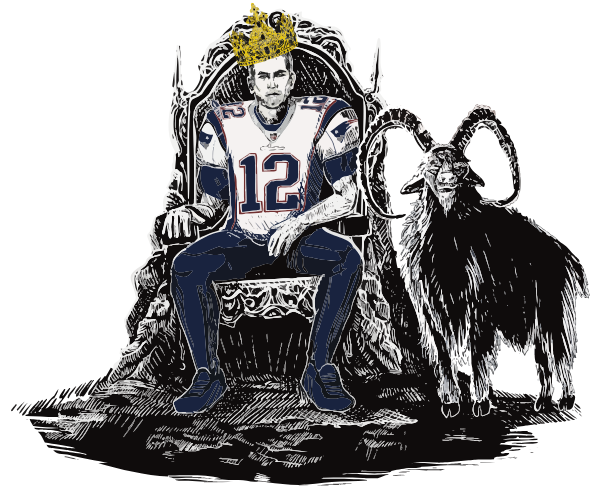

# Tom Brady Is Not The GOAT

A scroll-driven animated voting site arguing against Tom Brady's "GOAT" status. **Built as a working reference** for developers who want to ship animated marketing-style sites without a framework or a build pipeline.

🌐 **Live:** [tb12notgoat.com](https://www.tb12notgoat.com)
📄 **About:** [tb12notgoat.com/about](https://www.tb12notgoat.com/about)
📬 **Contact:** [rivers@riversgoat.com](mailto:rivers@riversgoat.com)

---

## Why this repo exists

Most "scroll-driven animated landing pages" you see are locked behind a build pipeline, a design system, and an agency. This one is **one HTML file, one Node server, two animation libraries, and hand-illustrated art**. The whole thing is open and readable — right-click, View Source, you have everything.

If you're a developer wanting to build something similar — pinned scroll sections, scrub timelines, a Rive character, a small shared API — copy the pieces you want. Each animation moment is self-contained and documented in the code. The [About page](https://www.tb12notgoat.com/about) and the per-pattern sections below explain the *why* alongside the *what*.

This repo is also an example of what's now possible without a senior engineer on the team — see the [About page citation](https://www.tb12notgoat.com/about) for the honest AI-collaboration breakdown.

---

## What's actually animated

Five visible moments on the home page. Each one is a different reusable pattern:

| Moment | Pattern | Library |
|---|---|---|
| [Hero impact](#1-hero-impact--scroll-driven-cross-fade) | Scrub timeline + image cross-fade | GSAP ScrollTrigger |
| [Accolades pin](#2-accolades-pin--stamp-down-on-scroll) | Pinned scrub timeline + stamp tweens | GSAP ScrollTrigger |
| [Brady puppet](#3-puppet-dance--vector-character-animation) | Linear timeline + scroll-velocity easter egg | Rive |
| [Vote → leaderboard](#4-vote-api--shared-real-time-totals) | Optimistic UI + Postgres UPSERT | Express + `pg` |
| [Mobile viewport shim](#5-mobile-viewport--url-bar-jitter-fix) | `visualViewport` + grow-only `--vh-px` | Vanilla JS + CSS |

Plus the [first-scroll-feel polish](#6-first-scroll-polish--why-svg-not-png) which is its own gotcha worth its own section.

---

## Stack at a glance

No framework, no build step, no transpilation. The browser opens `index.html` directly.

| Tool | Role | Docs |
|---|---|---|
| [GSAP 3.12](https://gsap.com/) + [ScrollTrigger](https://gsap.com/docs/v3/Plugins/ScrollTrigger/) | All scroll-driven animation | gsap.com/docs |
| [Rive](https://rive.app/) ([@rive-app/canvas](https://rive.app/community/doc/web-canvas/docs9bM6Z2hOe)) | Puppet character animation | rive.app/docs |
| [Express](https://expressjs.com/) | Node server (vote API + static serving) | expressjs.com |
| [pg (node-postgres)](https://node-postgres.com/) | Postgres client | node-postgres.com |
| [Postgres](https://www.postgresql.org/) | Vote storage | postgresql.org |
| [Railway](https://railway.app/) | Hosting (Node + managed Postgres) | docs.railway.app |
| [MDN: Visual Viewport API](https://developer.mozilla.org/en-US/docs/Web/API/Visual_Viewport_API) | Mobile URL-bar handling | MDN |

Hand illustration is the thing that isn't a library — Casey Rooney drew the candidate portraits and hero composition, Morgan Zavoral rigged the Brady puppet in Rive.

---

## Repo structure

```
.
├── index.html              ← Front-end (everything: HTML, inline CSS, inline JS)
├── about.html              ← /about page
├── server.js               ← Node + Express vote API
├── Dockerfile              ← node:20-alpine, used by Railway
├── package.json            ← Express + pg only
├── package-lock.json
├── LICENSE                 ← MIT for code, all-rights-reserved for art
├── README.md               ← You are here
├── Assets/
│   ├── tom-brady.svg               ← hero illustration
│   ├── tom-brady-shocked.svg       ← post-impact cross-fade target
│   ├── crown.svg / crown.png       ← crown that tumbles off
│   ├── goat.svg                    ← goat that appears in hero
│   ├── *-Profile.png               ← player photos for vote leaderboard
│   ├── walter-payton.png, philip-rivers.png, ...   ← candidate art
│   └── puppet/
│       ├── *.riv                   ← Rive rig files (open in rive.app)
│       └── *.svg / *.png           ← layered source art
└── .gitignore
```

> **One big file, by design.** `index.html` is ~5,000 lines because everything is inline — CSS, JS, no build step. Search for `_createHeroST`, `buildResults`, `partyUpdate`, `writeVote` etc. to jump to specific subsystems.

---

## The patterns (each is independently usable)

### 1. Hero impact — scroll-driven cross-fade

**What it does:** Hero opens calmly with "Tom Brady is the GOAT". On first scroll, the word **NOT** drops in red, "the" gets struck through, and Brady cross-fades to a shocked illustration. The entire sequence is tied to the scrollbar — the user controls the pace.

**Where it lives:** `index.html` — function `_createHeroST()` (~line 2300). Search for it.

**The pattern:**

```js
// 1. Build a paused timeline that animates the elements.
//    `scrub: true` on a ScrollTrigger ties timeline progress to
//    scroll progress, so the user drives the animation.
const _notDropTl = gsap.timeline({ paused: true })
  .fromTo('#not-text',
    { y: -600, opacity: 0 },
    { y: 0, opacity: 1, ease: 'power2.in', duration: 0.35 }, 0)
  .fromTo('.line-not-wrap',
    { height: 0 }, { height: 220, duration: 0.35 }, 0);

// 2. Pin the hero section and scrub the timeline by scroll.
ScrollTrigger.create({
  trigger: '.hero',
  start:   'top top',
  end:     window.innerWidth <= 767 ? '+=1600' : '+=1800',
  pin:     true,
  scrub:   true,
  animation: _notDropTl,
  onUpdate: self => {
    if (self.progress >= 0.18 && !_impactFired) fireImpact();
  },
});

// 3. fireImpact() runs ONCE in real time when the scroll progress
//    crosses 0.18 — crown tumble, src-swap to shocked Brady,
//    illo-wrap scale to 2.2.
```

**Gotchas we learned the hard way:**
- **Use SVG, not PNG, for any element you'll scale via transform.** PNG bitmaps re-rasterize on the first scale-up; that re-raster is the dominant first-scroll lag on mobile. SVGs scale natively. See [§6](#6-first-scroll-polish--why-svg-not-png).
- **Don't use `anticipatePin: 1`** unless you've tested on real mobile. Its first-encounter pre-prep shows up as a one-time stutter.
- **Hysteresis matters.** If you have a fire/reverse callback at a threshold, set the reverse threshold *well below* the fire threshold (we use `0.18` fire, `0.05` reverse). Otherwise small back-scroll wobbles re-fire the impact and you get a visible flicker.

📚 [GSAP ScrollTrigger docs](https://gsap.com/docs/v3/Plugins/ScrollTrigger/) · [GSAP Timeline docs](https://gsap.com/docs/v3/GSAP/Timeline/)

---

### 2. Accolades pin — stamp-down on scroll

**What it does:** Brady's championship rings, MVPs, and Super Bowl wins stamp onto the page one at a time as the user scrolls a pinned section. The user feels they're scrolling, but the page stays still while the timeline advances.

**Where it lives:** `index.html` — search for `.section-stage` ScrollTrigger.

**The pattern:**

```js
ScrollTrigger.create({
  trigger: '.intro-section',
  start:   'top top',
  end:     '+=2300vh',     // long pin — lots of scroll for the choreography
  pin:     '.section-stage',
  pinSpacing: true,
  scrub:   true,
  onUpdate: self => {
    const gp = self.progress;       // 0 → 1 across the whole section

    // Each stamp lands at a discrete progress mark.
    // Card visibility toggles via .in / .out classes that drive CSS
    // transitions (scale + filter blur for the stamp feel).
    cards.forEach((el, i) => {
      const sched = CARD_SCHED[i];   // { in: 0.43, out: 0.82 }
      el.classList.toggle('in',  gp >= sched.in && gp < sched.out);
      el.classList.toggle('out', gp >= sched.out);
    });
  },
});
```

**The CSS half:**

```css
.accolade {
  position: absolute;
  left: var(--x); top: var(--y);
  transform: translate(-50%, -50%) rotate(var(--rot)) scale(0);
  filter: blur(8px);
  opacity: 0;
  transition: opacity .25s, transform .35s cubic-bezier(.7,0,.9,.3), filter .3s;
}
.accolade.in  { opacity: 1; transform: translate(-50%, -50%) rotate(var(--rot)) scale(1); filter: blur(0); }
.accolade.out { opacity: 0; transform: translate(-50%, -50%) rotate(var(--rot)) scale(1.08); filter: blur(1.5px); }
```

**Why this approach:** Pin + scrub gives precise control over *when within the scroll* each element fires. Far more reliable than `position: sticky` for orchestrated multi-element sequences.

📚 [ScrollTrigger pinning](https://gsap.com/docs/v3/Plugins/ScrollTrigger/#pin)

---

### 3. Puppet dance — vector character animation

**What it does:** Cartoon Brady dances on a Rive timeline that follows scroll. Fast scrolling triggers a hidden "celebration" branch — the easter egg you see on rapid scroll-down.

**Where it lives:** `index.html` — search for `initPuppet`, `danceScrubGlobal`, `partyUpdate`. Source rigs in `Assets/puppet/*.riv` (open in [rive.app](https://rive.app/)).

**The pattern:**

```html
<canvas id="rive-dance-party"></canvas>
<script src="https://unpkg.com/@rive-app/canvas@latest/rive.js"></script>
```

```js
// Load the rig and start playing
const r = new rive.Rive({
  src: 'Assets/puppet/bradywithbones2.riv',
  canvas: document.getElementById('rive-dance-party'),
  autoplay: true,
  animations: 'dance_v2',     // animation name from the Rive editor
  onLoad: () => {
    r.resizeDrawingSurfaceToCanvas();
  },
});

// Scrub the dance to scroll progress (gp = 0 → 1 across the section)
function danceScrubGlobal(gp) {
  // 8.35 cycles across the whole intro — bumped from 5 because
  // user feedback was "we already scroll a lot, there's just not
  // a lot of movement". DANCE_DURATION is the rig's cycle length.
  r.scrub('dance_v2', gp * DANCE_DURATION * 8.35);
}
```

**Designer workflow:**
1. Designer rigs the character in [rive.app's editor](https://rive.app/) — layered SVG bones, named state machine inputs, timeline animations
2. Export as `.riv`
3. Web runtime (`@rive-app/canvas`) plays the rig with `Rive({ src, canvas, animations })`
4. Use `r.scrub(animationName, time)` to drive playback by scroll instead of real time

**Why Rive instead of CSS or Lottie:**
- ~50 KB for a full character vs 5+ MB for a comparable GIF
- Vector — sharp at any size, no re-raster on transform
- State machines: the same character can respond to multiple inputs (scroll, click, hover, velocity) without re-rigging
- Designer workflow stays in a designer tool

📚 [Rive web runtime docs](https://rive.app/community/doc/web-canvas/docs9bM6Z2hOe) · [Rive editor docs](https://rive.app/docs)

---

### 4. Vote API — shared real-time totals

**What it does:** Visitors vote for one of five candidates. Counts are stored in Postgres and displayed as a live leaderboard. Same totals seen by every visitor regardless of device. Brady votes are silently tracked but always render as `0` (he's the gag, not a real candidate).

**Where it lives:**
- `server.js` — entire backend (~150 lines)
- `index.html` — `writeVote()`, `fetchServerVotes()`, `buildResults()`

**The schema:**

```sql
CREATE TABLE IF NOT EXISTS votes (
  player_id  TEXT        PRIMARY KEY,
  count      INTEGER     NOT NULL DEFAULT 0,
  updated_at TIMESTAMPTZ NOT NULL DEFAULT now()
);
```

**The endpoints:**

```js
// server.js
const { Pool } = require('pg');
const pool = new Pool({
  connectionString: process.env.DATABASE_URL,
  ssl: { rejectUnauthorized: false },   // Railway managed PG
});

const ALLOWED = ['brady', 'rivers', 'alexander', 'payton', 'page'];

// One vote per IP per 2 seconds — minimal abuse prevention
const lastVoteByIp = new Map();
function rateLimitVote(req, res, next) {
  const ip = req.headers['x-forwarded-for']?.split(',')[0].trim() ||
             req.socket.remoteAddress || 'anon';
  if (Date.now() - (lastVoteByIp.get(ip) || 0) < 2000) {
    return res.status(429).json({ error: 'slow down' });
  }
  lastVoteByIp.set(ip, Date.now());
  next();
}

// UPSERT — atomic increment, safe under concurrent writes
app.post('/api/vote', rateLimitVote, async (req, res) => {
  const pid = req.body.player_id;
  if (!ALLOWED.includes(pid)) return res.status(400).json({ error: 'invalid' });
  const r = await pool.query(
    `INSERT INTO votes (player_id, count) VALUES ($1, 1)
     ON CONFLICT (player_id) DO UPDATE
       SET count = votes.count + 1, updated_at = now()
     RETURNING count`, [pid]);
  res.json({ ok: true, count: r.rows[0].count });
});

// CDN bypass — without this, Railway/Fastly cached the JSON and
// different visitors saw different totals
app.use('/api', (req, res, next) => {
  res.set('Cache-Control', 'no-store, no-cache, must-revalidate, max-age=0');
  next();
});
```

**Optimistic UI on the front end:**

```js
function writeVote(pid) {
  // 1. Bump localStorage immediately so the UI feels instant
  const v = JSON.parse(localStorage.getItem('goat_votes') || '{}');
  v[pid] = (v[pid] || 0) + 1;
  localStorage.setItem('goat_votes', JSON.stringify(v));

  // 2. Fire the POST. keepalive: true lets it complete even if
  //    the page navigates away (used for the Brady redirect)
  fetch('/api/vote', {
    method: 'POST',
    headers: { 'Content-Type': 'application/json' },
    body:    JSON.stringify({ player_id: pid }),
    keepalive: true,
  }).catch(e => console.warn('[vote] server failed:', e.message));
}
```

**Querying votes** (e.g. from the Railway → Postgres → Data tab):

```sql
SELECT player_id, count, updated_at FROM votes ORDER BY count DESC;
```

📚 [Express docs](https://expressjs.com/en/4x/api.html) · [node-postgres docs](https://node-postgres.com/) · [Railway Postgres docs](https://docs.railway.app/databases/postgresql)

---

### 5. Mobile viewport — URL-bar jitter fix

**What it does:** On Android Chrome / Brave, the URL bar's expand/collapse animation makes `100vh` resolve to wildly different values during a scroll, which produces the "everything in the corner of the screen" mobile bug for any pinned section. This shim publishes a CSS custom property `--vh-px` that grows but never shrinks, so the layout is stable.

**Where it lives:** `index.html` — the FIRST `<script>` block in `<head>`. Runs before any CSS paints.

**The pattern:**

```html
<!-- This script must run before CSS paints. Inline in <head>, no defer. -->
<script>
(function(){
  function currentVH() {
    if (window.visualViewport && window.visualViewport.height) {
      return Math.round(window.visualViewport.height);
    }
    return window.innerHeight || document.documentElement.clientHeight || 0;
  }

  let lastH = 0;
  function setVH() {
    const h = currentVH();
    if (!h) return;
    if (h > lastH) lastH = h;     // grow-only high-water mark
    document.documentElement.style.setProperty('--vh-px', lastH + 'px');
  }

  setVH();
  window.addEventListener('resize', setVH, { passive: true });
  if (window.visualViewport) {
    window.visualViewport.addEventListener('resize', setVH, { passive: true });
  }

  // New orientation = new universe. Reset the high-water mark.
  window.addEventListener('orientationchange', () => {
    lastH = 0;
    setTimeout(setVH, 150);
    setTimeout(setVH, 400);
  }, { passive: true });
})();
</script>
```

**Use it in CSS as the height for any pinned section:**

```css
.section-stage {
  height: 100vh;
  height: 100svh;
  height: var(--vh-px, 100svh);    /* JS shim, falls back to svh */
  overflow: hidden;
}
```

**Why `visualViewport.height` instead of `window.innerHeight`:** `visualViewport` reports the actually-visible region. `innerHeight` reports the layout viewport, which on mobile during URL-bar transitions is wrong by 80–120px.

📚 [MDN: Visual Viewport API](https://developer.mozilla.org/en-US/docs/Web/API/Visual_Viewport_API) · [web.dev: viewport units](https://web.dev/blog/viewport-units)

---

### 6. First-scroll polish — why SVG, not PNG

**The bug we hit:** On mobile, the hero impact (specifically the zoom-in on shocked Brady) felt janky on the *first* scroll-down and smooth on every subsequent scroll. The `transform: scale(2.2)` on the Brady image was paying a one-time cost that was cached after the first play.

**The cause:** PNG bitmaps. When you scale a `` up via CSS transform, the browser must re-rasterize the image at the larger size to keep it sharp. That re-raster happens on the first frame of the first scale tween — which is exactly when the user's first scroll is animating. Frames drop. On the second play, the larger raster is cached. Smooth.

**The fix:** SVG. Vector. No re-raster cost ever. `transform: scale(2.2)` is just a math operation on the path data.

```html
<!-- ❌ BAD on mobile if the image will be transform-scaled -->


<!-- ✅ GOOD — SVG scales natively without re-rasterization -->

```

**Bonus gotcha:** Adobe Illustrator's "Save as SVG" can strip the inline `<style>` block out of `<defs>`, leaving the path data referencing CSS classes that no longer exist. Every path renders as the default fill (black) and you get the "silhouette bug". If your SVG is showing as a black silhouette, open it in a text editor and confirm `<defs><style>...</style></defs>` is populated. If not, ask the designer to re-export with "SVG with Style Element".

**Other things that helped on the path to this fix** (kept because they help, even with SVG):
- `will-change: transform, opacity` on the wrapper element — pre-allocates the GPU compositor layer
- `<link rel="preload" as="image" href="...">` for the swap target — bytes are already on disk when needed
- Tight fire/reverse hysteresis on the scroll callback (see [§1](#1-hero-impact--scroll-driven-cross-fade))

📚 [MDN: rel=preload](https://developer.mozilla.org/en-US/docs/Web/HTML/Attributes/rel/preload) · [MDN: will-change](https://developer.mozilla.org/en-US/docs/Web/CSS/will-change)

---

## Local development

### Just want to look at the page

```bash
git clone https://github.com/wmcclung/tb12notgoat.git
cd tb12notgoat
npx serve .
```

Open [http://localhost:3000](http://localhost:3000). The vote API will return errors (no Postgres) but the hero, puppet, and About page all work.

### Run the full stack locally (vote API too)

```bash
git clone https://github.com/wmcclung/tb12notgoat.git
cd tb12notgoat
npm install
DATABASE_URL=postgresql://localhost/tb12 node server.js
```

You'll need a local Postgres or a remote one. The `votes` table is auto-created on first boot.

### Deploy

This repo deploys to [Railway](https://railway.app/):

1. Connect the repo to a Railway project
2. Add a Postgres add-on (Railway auto-injects `DATABASE_URL`)
3. Map your domain in Networking, target port `3000`
4. Push to `master` — Railway redeploys automatically

The `Dockerfile` is set up for `node:20-alpine`. No CI/CD config needed beyond the GitHub repo connection.

---

## Credits

- **Code, design direction, product:** [Will McClung](https://github.com/wmcclung) — built collaboratively with [Claude](https://claude.ai) (Anthropic) across Claude Code, claude.ai, and Claude in Chrome. See the [About page](https://www.tb12notgoat.com/about) for the full AI-collaboration citation.
- **Illustrations** (candidate portraits, hero composition, shocked Brady, crown, goat): [Casey Rooney](https://thecitygoblin.myportfolio.com/)
- **Brady puppet rig** (12-bone Rive character, dance + celebration animations): Morgan Zavoral

---

## License

[MIT](LICENSE) for the source code. Everything in `/Assets/` is the property of its respective creator and is **not** covered by the MIT license — see [`LICENSE`](LICENSE) for the full attribution. If you want to use the artwork in your own project, contact the creators directly.

The intent: copy the code patterns freely, substitute your own art.

---

## Contact

[rivers@riversgoat.com](mailto:rivers@riversgoat.com)

If you build something inspired by this, a link back is appreciated but not required.
